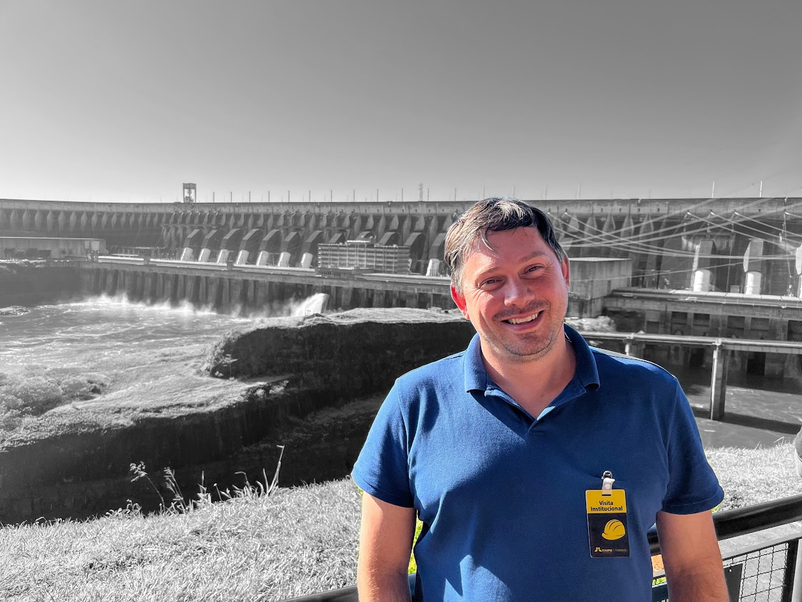

# Rafael Zavalik Castro - Engenheiro Eletricista ⚡
<table>
  <tr>
    <td>
    
     </td>
    <td>
      Sou Engenheiro Eletricista, consultoria em eficiência energética e engenharia clínica. Com experiência em implantação de tecnologias hospitalares 🏥, cirurgia robótica 🤖 e gestão de equipamentos médicos, também atuo como instrutor de treinamentos NR10. Atualmente, estou trabalhando no desenvolvimento projetos de IoT e participando de projetos inovadores na área de automação hospitalar ⚙️.
    </td>
  </tr>
</table>

## 🌟 Experiência Profissional

### Engenheiro Eletricista no INMETRO - Santo Ângelo
Desde 2006, atuando na área de **metrologia** e **engenharia elétrica** ⚡.

### Membro do Comitê de Cirurgia Robótica 🤖
- Participação na **implantação do site planning do Da Vinci X** (cirurgia robótica).
- Auxílio na implantação do **GE Allia 530**, o primeiro equipamento desse modelo no Brasil.

### 🔧 Projetos em Andamento
- Desenvolvimento do layout para a instalação de uma **câmara hiperbárica** 🫧.
- Facilitador em projetos de **treinamentos de NR10** e **consultoria em acreditação hospitalar**.

## 🎓 Formação Acadêmica
- **Engenharia Elétrica** - URI - Santo Angelo 🎓
- **Pós-graduação em Engenharia Clínica** - Unyleya 📚
- Cursando inglês na Wizard 🇬🇧.

## 📚 Publicações
- **Congresso Nacional de Automática do Brasil**  
  *Sistema Embarcado para Registro e Controle de Higienização de Mãos em Ambientes de Saúde*  
  Artigo escrito em colaboração com Dr. Alexandre Roque.

## 💡 Habilidades
- ⚡ **Projetos Elétricos**
- 🌱 **Eficiência Energética**
- 🏥 **Consultoria em Engenharia Clínica**
- 🤖 **Cirurgia Robótica**
- 📋 **Treinamentos NR10**
- ⚙️ **Automação Hospitalar**
- 🛠 **Gestão de Equipamentos Médicos**

## 📫 Contato
- **LinkedIn**: [Rafael Zavalik Castro](https://www.linkedin.com/in/rafaelzcastro/) 🔗
- **Email**: rafael.zavalik.castro@email.com ✉️
